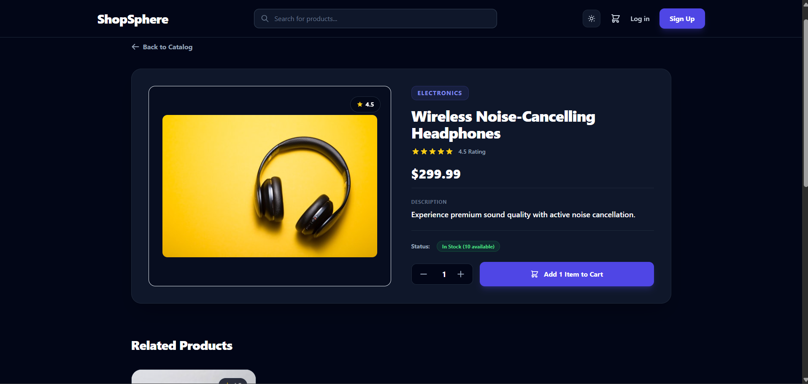
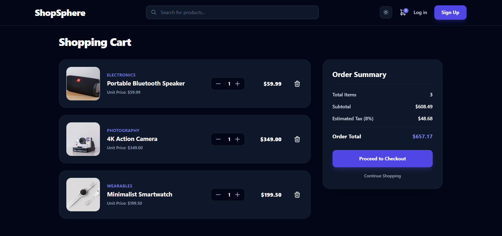
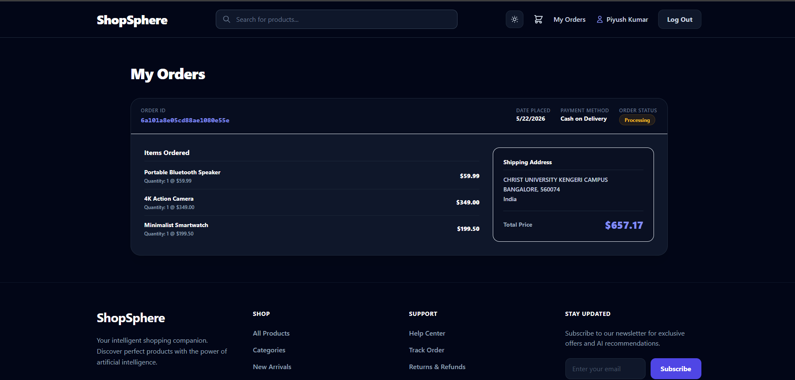

# ShopSphere

A modern full-stack MERN ecommerce platform built to deliver a seamless online shopping experience with secure authentication, dynamic product discovery, responsive UI, cart & checkout workflows, order management, advanced filtering, and dark/light theme support.

Designed with scalability, clean architecture, and modern frontend/backend practices using the MERN stack.

---

## Live Demo

### Frontend
https://shopsphere-mauve.vercel.app

### Backend API
https://shopsphere-backend-kxza.onrender.com

---

# Project Preview

## Home Page


---

## Product Details Page



---

## Shopping Cart



---

## Checkout Flow


---

## Orders Dashboard



---

# Key Features

## Authentication & Security
- JWT-based Authentication System
- User Registration & Login
- Protected Routes
- Persistent User Sessions
- Secure API Access
- Password Encryption using bcryptjs

---

## Ecommerce Functionalities
- Dynamic Product Catalog
- Product Details Page
- Related Products Suggestions
- Quantity Selection Controls
- Shopping Cart Management
- Checkout Workflow
- Order Placement System
- User Order History Dashboard

---

## Search & Filtering
- Real-time Product Search
- Category-based Filtering
- Combined Search + Filter Logic
- Dynamic Empty State Handling
- URL-based Filter Persistence

---

## User Experience & Interface
- Fully Responsive Layout
- Modern Ecommerce UI Design
- Dark / Light Theme Toggle
- Persistent Theme Preference
- Smooth UI Transitions
- Mobile Optimized Experience
- Interactive Product Cards
- Loading & Error States

---

## Backend & API Features
- RESTful API Architecture
- MongoDB Atlas Cloud Database
- Express.js Backend Server
- Mongoose Data Models
- Authentication Middleware
- Order Management APIs
- Environment Variable Configuration

---

# Tech Stack

## Frontend
- React.js
- Vite
- Tailwind CSS
- React Router DOM
- Axios
- Context API

---

## Backend
- Node.js
- Express.js
- MongoDB Atlas
- Mongoose
- JWT Authentication
- bcryptjs

---

# Project Architecture

```text
shopsphere/
│
├── backend/
│   ├── config/
│   ├── middleware/
│   ├── models/
│   ├── routes/
│   ├── server.js
│   └── seed.js
│
├── frontend/
│   ├── src/
│   │   ├── assets/
│   │   ├── components/
│   │   ├── context/
│   │   ├── pages/
│   │   ├── App.jsx
│   │   └── main.jsx
│   │
│   ├── public/
│   └── vite.config.js
│
├── screenshots/
│
└── README.md
```

---

# Core Functionalities

## Authentication Flow
- User Registration
- User Login
- JWT Token Generation
- Protected Route Authorization
- Persistent Sessions
- Logout Functionality

---

## Product Browsing Flow
- Browse Products
- Product Search
- Category Filtering
- Combined Search & Filtering
- Product Details Navigation
- Related Products Display

---

## Cart & Checkout Flow
- Add Products to Cart
- Quantity Management
- Remove Cart Items
- Persistent Cart State
- Checkout Form Handling
- Demo Payment Workflow
- Order Placement

---

## Order Management
- Order Success Confirmation
- User Order History
- Order Status Display
- Shipping Details Tracking

---

## UI & Experience
- Responsive Design System
- Dark / Light Theme Toggle
- Theme Persistence
- Loading States
- Error Handling
- Empty State Components

---

# Deployment

## Frontend Hosting
- Vercel

## Backend Hosting
- Render

## Database
- MongoDB Atlas

---

# Future Improvements

- Wishlist Functionality
- Payment Gateway Integration
- Product Reviews & Ratings
- Personalized Product Recommendations
- Admin Dashboard
- Inventory Analytics
- Coupon & Discount System
- Advanced Product Sorting
- User Profile Management

---

# Author

## Piyush Kumar

GitHub:  
https://github.com/piyushkr2003

---

# License

This project is built for educational, learning, and portfolio purposes.